# Data Model: Professional Athlete Supplements E-commerce Platform

## 1. Introduction

This document outlines the revised data model for the Professional Athlete Supplements E-commerce Platform. It defines the key entities, their attributes, and relationships that will power the platform's PostgreSQL database structure. This model reflects a monolithic architecture with a focus on dynamic content and improved categorization.

## 2. Entity-Relationship Diagram

The following diagram illustrates the relationships between the main entities in our revised data model:

```mermaid
erDiagram
    Users ||--o{ Orders : places
    Users ||--o{ Addresses : has
    Users ||--o{ Reviews : writes
    Users ||--o{ WishLists : has
    Users ||--o{ Referrals : creates
    Users ||--o{ Consultations : books
    Users ||--o{ RecentlyViewed : views
    Users ||--o{ analytics_events : generates
    
    Products ||--o{ OrderItems : "included in"
    Products ||--o{ Reviews : receives
    Products ||--o{ WishListItems : "added to"
    Products ||--o{ ProductImages : has
    Products ||--o{ InventoryLogs : has
    Products ||--o{ ProductVariants : has
    Products ||--o{ ProductFAQs : has
    Products }|--o{ RelatedProducts : "appears in"
    Products ||--o{ url_mappings : "redirects to"
    Products ||--o{ analytics_events : "tracked for"
    
    Categories ||--o{ product_categories : has
    product_categories }|--|| Products : contains
    Categories ||--o{ url_mappings : "redirects to"
    
    Sports ||--o{ product_sports : has
    product_sports }|--|| Products : associates
    
    Goals ||--o{ product_goals : has
    product_goals }|--|| Products : targets
    
    Orders ||--o{ OrderItems : contains
    Orders ||--|| Payments : has
    Orders ||--o{ analytics_events : "tracked for"
    
    WishLists ||--o{ WishListItems : contains
    
    Banners ||--o{ Popups : includes
    
    Blogs ||--o{ BlogFAQs : has
    Blogs }|--o{ BlogCategories : "belongs to"
    Blogs ||--o{ BlogNavigationLinks : has
    Blogs }|--o{ RelatedProducts : "features"
    Blogs ||--o{ url_mappings : "redirects to"
    Blogs ||--o{ analytics_events : "tracked for"
    
    Carts ||--o{ CartItems : contains
    Users ||--|| Carts : has
    Products ||--o{ CartItems : "added to"
    Carts ||--o{ analytics_events : "tracked for"
    
    Referrals ||--o{ ReferralRewards : generates
    
    Coupons ||--o{ CouponUsage : tracks
    
    FAQs ||--o{ ProductFAQs : "used in"
    FAQs ||--o{ CategoryFAQs : "used in"
    FAQs ||--o{ BlogFAQs : "used in"
    
    content_blocks }|--|| Products : "attached to"
    content_blocks }|--|| Categories : "attached to"
    content_blocks }|--|| Blogs : "attached to"
    content_blocks }|--|| page_metadata : "used in"
    
    page_metadata }|--|| Products : "describes"
    page_metadata }|--|| Categories : "describes"
    page_metadata }|--|| Blogs : "describes"
    
    analytics_configuration |o--o{ analytics_events : configures
    analytics_reports ||--o{ analytics_events : analyzes
```

## 3. Entity Descriptions

### 3.1 User Management Entities

#### 3.1.1 Users
- **Description**: Stores information about registered users (customers and administrators)
- **Primary Key**: `user_id` (SERIAL)
- **Attributes**:
  - `email` (VARCHAR, UNIQUE): User's email address
  - `password_hash` (VARCHAR): Hashed password
  - `first_name` (VARCHAR): User's first name
  - `last_name` (VARCHAR): User's last name
  - `phone` (VARCHAR): User's phone number
  - `user_type` (VARCHAR): Customer or Admin
  - `created_at` (TIMESTAMP): Account creation date
  - `updated_at` (TIMESTAMP): Last update date
  - `last_login_at` (TIMESTAMP): Last login date
  - `auth_provider` (VARCHAR): Email or Google (for social login)
  - `auth_provider_id` (VARCHAR): ID from auth provider (for social login)
  - `is_active` (BOOLEAN): Whether the user account is active

#### 3.1.2 Addresses
- **Description**: Stores user's delivery addresses
- **Primary Key**: `address_id` (SERIAL)
- **Foreign Key**: `user_id` references Users(user_id)
- **Attributes**:
  - `address_line1` (VARCHAR): Street address
  - `address_line2` (VARCHAR): Apartment, unit, etc.
  - `city` (VARCHAR): City name
  - `state` (VARCHAR): State name
  - `postal_code` (VARCHAR): ZIP/postal code
  - `country` (VARCHAR): Country name
  - `is_default` (BOOLEAN): Whether this is the default address
  - `label` (VARCHAR): Home, Work, etc.

### 3.2 Product Catalog Entities

#### 3.2.1 Categories
- **Description**: High-level product categories (21 total categories)
- **Primary Key**: `category_id` (SERIAL)
- **Attributes**:
  - `name` (VARCHAR): Category name
  - `description` (TEXT): Category description
  - `image_url` (VARCHAR): Category image URL
  - `is_active` (BOOLEAN): Whether the category is active
  - `display_order` (INTEGER): Order for display purposes
  - `slug` (VARCHAR, UNIQUE): URL-friendly version of name
  - `created_at` (TIMESTAMP): Creation timestamp
  - `updated_at` (TIMESTAMP): Last update timestamp

#### 3.2.2 Sports
- **Description**: Sports that products can be associated with (8-10 sports)
- **Primary Key**: `sport_id` (SERIAL)
- **Attributes**:
  - `name` (VARCHAR): Sport name (e.g., Running, Cricket, Bodybuilding)
  - `description` (TEXT): Sport description
  - `icon_url` (VARCHAR): Sport icon URL
  - `is_active` (BOOLEAN): Whether the sport is active
  - `display_order` (INTEGER): Order for display purposes
  - `slug` (VARCHAR, UNIQUE): URL-friendly version of name
  - `created_at` (TIMESTAMP): Creation timestamp
  - `updated_at` (TIMESTAMP): Last update timestamp

#### 3.2.3 Goals
- **Description**: Fitness/health goals that products can target (12 goals)
- **Primary Key**: `goal_id` (SERIAL)
- **Attributes**:
  - `name` (VARCHAR): Goal name (e.g., Weight Loss, Muscle Gain, Recovery)
  - `description` (TEXT): Goal description
  - `icon_url` (VARCHAR): Goal icon URL
  - `is_active` (BOOLEAN): Whether the goal is active
  - `display_order` (INTEGER): Order for display purposes
  - `slug` (VARCHAR, UNIQUE): URL-friendly version of name
  - `created_at` (TIMESTAMP): Creation timestamp
  - `updated_at` (TIMESTAMP): Last update timestamp

#### 3.2.4 Products
- **Description**: Stores information about products
- **Primary Key**: `product_id` (SERIAL)
- **Attributes**:
  - `name` (VARCHAR): Product name
  - `description` (TEXT): Detailed product description
  - `short_description` (VARCHAR): Brief product description
  - `brand_enum` (VARCHAR): Brand name (enum with 2 values)
  - `sku` (VARCHAR, UNIQUE): Stock Keeping Unit
  - `barcode` (VARCHAR): Product barcode
  - `weight` (DECIMAL): Product weight in grams
  - `dimensions` (VARCHAR): Product dimensions (LxWxH)
  - `is_active` (BOOLEAN): Whether product is active
  - `is_highlighted` (BOOLEAN): Featured product flag
  - `created_at` (TIMESTAMP): Creation date
  - `updated_at` (TIMESTAMP): Last update date
  - `slug` (VARCHAR, UNIQUE): URL-friendly version of name
  - `meta_title` (VARCHAR): SEO meta title
  - `meta_description` (VARCHAR): SEO meta description
  - `avg_rating` (DECIMAL): Average product rating
  - `serving_size` (VARCHAR): Serving size information
  - `servings_per_container` (INTEGER): Number of servings
  - `protein_content` (VARCHAR): Amount of protein per serving
  - `ingredients` (TEXT): List of ingredients
  - `directions` (TEXT): Usage directions
  - `warnings` (TEXT): Warning information
  - `low_stock_threshold` (INTEGER): Threshold for low stock alert (default 2)

#### 3.2.5 ProductVariants
- **Description**: Stores product variants like different flavors, sizes, etc.
- **Primary Key**: `variant_id` (SERIAL)
- **Foreign Key**: `product_id` references Products(product_id)
- **Attributes**:
  - `sku` (VARCHAR): Variant-specific SKU
  - `name` (VARCHAR): Variant name
  - `flavor` (VARCHAR): Flavor variant (e.g., "Chocolate", "Vanilla")
  - `size` (VARCHAR): Size variant (e.g., "500g", "1kg")
  - `price` (DECIMAL): Price of this variant
  - `sale_price` (DECIMAL): Discounted price (if on sale)
  - `discount_percentage` (DECIMAL): Calculated discount percentage
  - `stock_quantity` (INTEGER): Variant-specific stock
  - `is_active` (BOOLEAN): Whether variant is active
  - `is_default` (BOOLEAN): Whether this is the default variant to display
  - `image_url` (VARCHAR): Variant-specific image URL
  - `created_at` (TIMESTAMP): Creation date
  - `updated_at` (TIMESTAMP): Last update date

#### 3.2.6 product_categories (Junction Table)
- **Description**: Many-to-many relationship between products and categories
- **Primary Key**: `product_id`, `category_id`
- **Foreign Keys**:
  - `product_id` references Products(product_id)
  - `category_id` references Categories(category_id)
- **Attributes**:
  - `display_order` (INTEGER): Order for display purposes within category

#### 3.2.7 product_sports (Junction Table)
- **Description**: Many-to-many relationship between products and sports
- **Primary Key**: `product_id`, `sport_id`
- **Foreign Keys**:
  - `product_id` references Products(product_id)
  - `sport_id` references Sports(sport_id)
- **Attributes**:
  - `relevance` (INTEGER): Relevance score (1-10)

#### 3.2.8 product_goals (Junction Table)
- **Description**: Many-to-many relationship between products and goals
- **Primary Key**: `product_id`, `goal_id`
- **Foreign Keys**:
  - `product_id` references Products(product_id)
  - `goal_id` references Goals(goal_id)
- **Attributes**:
  - `effectiveness` (INTEGER): Effectiveness score (1-10)

#### 3.2.9 ProductImages
- **Description**: Stores product images
- **Primary Key**: `image_id` (SERIAL)
- **Foreign Key**: `product_id` references Products(product_id)
- **Attributes**:
  - `image_url` (VARCHAR): URL to the image file
  - `alt_text` (VARCHAR): Alternative text for accessibility
  - `sort_order` (INTEGER): Display order of images
  - `is_primary` (BOOLEAN): Whether it's the main product image
  - `created_at` (TIMESTAMP): Upload date

#### 3.2.10 RelatedProducts
- **Description**: Stores "Usually bought together" and related product relationships
- **Primary Key**: `related_id` (SERIAL)
- **Foreign Keys**:
  - `product_id` references Products(product_id)
  - `related_product_id` references Products(product_id)
  - `blog_id` references Blogs(blog_id) (NULLABLE)
- **Attributes**:
  - `relationship_type` (VARCHAR): "bought_together", "related", "recommended", "blog_featured"
  - `relevance_score` (INTEGER): How relevant the relationship is (1-100)
  - `is_auto_generated` (BOOLEAN): Whether created by algorithm or manually
  - `created_at` (TIMESTAMP): Creation date
  - `updated_at` (TIMESTAMP): Last update date

### 3.3 Review and Rating Entities

#### 3.3.1 Reviews
- **Description**: Stores customer reviews and ratings for products
- **Primary Key**: `review_id` (SERIAL)
- **Foreign Keys**:
  - `user_id` references Users(user_id)
  - `product_id` references Products(product_id)
  - `order_id` references Orders(order_id) (to verify purchase)
- **Attributes**:
  - `rating` (INTEGER): Rating score (1-5)
  - `title` (VARCHAR): Review title
  - `content` (TEXT): Review text
  - `is_verified_purchase` (BOOLEAN): Whether from verified purchase
  - `created_at` (TIMESTAMP): Submission date
  - `updated_at` (TIMESTAMP): Last update date
  - `status` (VARCHAR): Pending, Approved, Rejected
  - `helpful_votes` (INTEGER): Number of helpful votes

### 3.4 Wishlist Entities

#### 3.4.1 WishLists
- **Description**: Stores user wishlists
- **Primary Key**: `wishlist_id` (SERIAL)
- **Foreign Key**: `user_id` references Users(user_id)
- **Attributes**:
  - `name` (VARCHAR): Optional wishlist name
  - `created_at` (TIMESTAMP): Creation date
  - `updated_at` (TIMESTAMP): Last update date

#### 3.4.2 WishListItems
- **Description**: Stores items in wishlists
- **Primary Key**: `wishlist_item_id` (SERIAL)
- **Foreign Keys**:
  - `wishlist_id` references WishLists(wishlist_id)
  - `product_id` references Products(product_id)
  - `variant_id` references ProductVariants(variant_id) (NULLABLE)
- **Attributes**:
  - `added_at` (TIMESTAMP): Date item was added
  - `notes` (VARCHAR): Optional user notes

### 3.5 Order and Cart Entities

#### 3.5.1 Carts
- **Description**: Stores user shopping carts
- **Primary Key**: `cart_id` (SERIAL)
- **Foreign Key**: `user_id` references Users(user_id) (NULLABLE for guest carts)
- **Attributes**:
  - `session_id` (VARCHAR): Session ID for guest users
  - `created_at` (TIMESTAMP): Creation date
  - `updated_at` (TIMESTAMP): Last update date
  - `expires_at` (TIMESTAMP): Expiration date for guest carts

#### 3.5.2 CartItems
- **Description**: Stores items in shopping carts
- **Primary Key**: `cart_item_id` (SERIAL)
- **Foreign Keys**:
  - `cart_id` references Carts(cart_id)
  - `product_id` references Products(product_id)
  - `variant_id` references ProductVariants(variant_id) (NULLABLE)
- **Attributes**:
  - `quantity` (INTEGER): Number of items
  - `price_at_addition` (DECIMAL): Price when added to cart
  - `added_at` (TIMESTAMP): Date item was added

#### 3.5.3 Orders
- **Description**: Stores customer orders
- **Primary Key**: `order_id` (SERIAL)
- **Foreign Key**: `user_id` references Users(user_id)
- **Attributes**:
  - `order_number` (VARCHAR, UNIQUE): Human-readable order ID
  - `order_date` (TIMESTAMP): Date order was placed
  - `total_amount` (DECIMAL): Total order amount
  - `subtotal` (DECIMAL): Order subtotal before tax/shipping
  - `tax_amount` (DECIMAL): Tax amount
  - `shipping_amount` (DECIMAL): Shipping cost
  - `discount_amount` (DECIMAL): Discount amount
  - `shipping_address_id` references Addresses(address_id)
  - `billing_address_id` references Addresses(address_id)
  - `status` (VARCHAR): Order status (Pending, Confirmed, Processing, Shipped, Delivered, Cancelled)
  - `status_history` (JSONB): History of status changes with timestamps
  - `notes` (TEXT): Order notes
  - `referral_code` (VARCHAR): Referral code used (if any)
  - `coupon_code` (VARCHAR): Coupon code used (if any)
  - `tracking_number` (VARCHAR): Shipping tracking number
  - `carrier` (VARCHAR): Shipping carrier
  - `shipping_method` (VARCHAR): Shipping method
  - `shipped_date` (TIMESTAMP): Date shipped
  - `estimated_delivery` (TIMESTAMP): Estimated delivery date
  - `actual_delivery` (TIMESTAMP): Actual delivery date
  - `created_at` (TIMESTAMP): Order creation date
  - `updated_at` (TIMESTAMP): Last update date

#### 3.5.4 OrderItems
- **Description**: Stores items in orders
- **Primary Key**: `order_item_id` (SERIAL)
- **Foreign Keys**:
  - `order_id` references Orders(order_id)
  - `product_id` references Products(product_id)
  - `variant_id` references ProductVariants(variant_id) (NULLABLE)
- **Attributes**:
  - `quantity` (INTEGER): Number of items ordered
  - `unit_price` (DECIMAL): Price per unit
  - `total_price` (DECIMAL): Total price for the line item
  - `sku` (VARCHAR): SKU at time of purchase
  - `product_name` (VARCHAR): Product name at time of purchase
  - `variant_name` (VARCHAR): Variant name at time of purchase

#### 3.5.5 Payments
- **Description**: Stores payment information for orders
- **Primary Key**: `payment_id` (SERIAL)
- **Foreign Key**: `order_id` references Orders(order_id)
- **Attributes**:
  - `payment_method` (VARCHAR): Payment method used
  - `payment_gateway` (VARCHAR): Payment gateway used (Razorpay/PhonePe)
  - `transaction_id` (VARCHAR): Payment gateway transaction ID
  - `amount` (DECIMAL): Payment amount
  - `currency` (VARCHAR): Payment currency
  - `status` (VARCHAR): Payment status
  - `created_at` (TIMESTAMP): Payment date
  - `updated_at` (TIMESTAMP): Last update date

### 3.6 Inventory Management Entities

#### 3.6.1 InventoryLogs
- **Description**: Stores inventory change history
- **Primary Key**: `log_id` (SERIAL)
- **Foreign Keys**:
  - `product_id` references Products(product_id)
  - `variant_id` references ProductVariants(variant_id) (NULLABLE)
- **Attributes**:
  - `change_type` (VARCHAR): Type of inventory change (sale, restock, adjustment)
  - `quantity_change` (INTEGER): Amount of change (+/-)
  - `previous_quantity` (INTEGER): Quantity before change
  - `new_quantity` (INTEGER): Quantity after change
  - `reference_id` (VARCHAR): Related order ID or reference
  - `notes` (TEXT): Notes about the inventory change
  - `created_by` references Users(user_id): User who made the change
  - `created_at` (TIMESTAMP): Date of the inventory change

### 3.7 Content Management Entities

#### 3.7.1 Banners
- **Description**: Stores promotional banners for the website
- **Primary Key**: `banner_id` (SERIAL)
- **Attributes**:
  - `title` (VARCHAR): Banner title
  - `image_url` (VARCHAR): Banner image URL
  - `link_url` (VARCHAR): URL the banner links to
  - `alt_text` (VARCHAR): Image alternative text
  - `position` (VARCHAR): Banner position on the website
  - `banner_type` (VARCHAR): Type of banner (hero, promotional, category, popup)
  - `start_date` (TIMESTAMP): When the banner should start displaying
  - `end_date` (TIMESTAMP): When the banner should stop displaying
  - `is_active` (BOOLEAN): Whether the banner is active
  - `created_at` (TIMESTAMP): Creation date
  - `updated_at` (TIMESTAMP): Last update date

#### 3.7.2 Popups
- **Description**: Stores popup messages/offers for the website
- **Primary Key**: `popup_id` (SERIAL)
- **Foreign Key**: `banner_id` references Banners(banner_id) (NULLABLE)
- **Attributes**:
  - `title` (VARCHAR): Popup title
  - `content` (TEXT): Popup content
  - `image_url` (VARCHAR): Optional popup image
  - `cta_text` (VARCHAR): Call to action button text
  - `cta_link` (VARCHAR): Call to action button link
  - `trigger_event` (VARCHAR): When to show (page_load, exit_intent, time_delay)
  - `delay_seconds` (INTEGER): Seconds to delay showing popup
  - `show_once_per_session` (BOOLEAN): Whether to show once per session
  - `show_once_per_user` (BOOLEAN): Whether to show once per user
  - `start_date` (TIMESTAMP): When to start showing the popup
  - `end_date` (TIMESTAMP): When to stop showing the popup
  - `eligible_pages` (VARCHAR): Pages where popup should appear
  - `is_active` (BOOLEAN): Whether the popup is active
  - `created_at` (TIMESTAMP): Creation date
  - `updated_at` (TIMESTAMP): Last update date

#### 3.7.3 Blogs
- **Description**: Stores blog posts
- **Primary Key**: `blog_id` (SERIAL)
- **Foreign Key**: `author_id` references Users(user_id)
- **Attributes**:
  - `title` (VARCHAR): Blog post title
  - `content` (TEXT): Blog post content
  - `excerpt` (TEXT): Short excerpt/summary
  - `slug` (VARCHAR, UNIQUE): URL-friendly version of title
  - `featured_image` (VARCHAR): Featured image URL
  - `blog_category` (VARCHAR): Blog category
  - `published_at` (TIMESTAMP): Publication date
  - `status` (VARCHAR): Draft, Published, Archived
  - `created_at` (TIMESTAMP): Creation date
  - `updated_at` (TIMESTAMP): Last update date

#### 3.7.4 BlogCategories
- **Description**: Categories for blog posts
- **Primary Key**: `blog_category_id` (SERIAL)
- **Attributes**:
  - `name` (VARCHAR): Category name
  - `description` (TEXT): Category description
  - `slug` (VARCHAR, UNIQUE): URL-friendly version of name
  - `is_active` (BOOLEAN): Whether category is active
  - `display_order` (INTEGER): Display order priority

#### 3.7.5 BlogNavigationLinks
- **Description**: Navigation links within blog posts
- **Primary Key**: `link_id` (SERIAL)
- **Foreign Key**: `blog_id` references Blogs(blog_id)
- **Attributes**:
  - `link_text` (VARCHAR): Link display text
  - `link_url` (VARCHAR): URL to link to
  - `link_type` (VARCHAR): Internal or External
  - `display_order` (INTEGER): Order within the blog post
  - `created_at` (TIMESTAMP): Creation date

### 3.8 Referral Program Entities

#### 3.8.1 Referrals
- **Description**: Stores user referral codes and relationships
- **Primary Key**: `referral_id` (SERIAL)
- **Foreign Key**: `referrer_id` references Users(user_id)
- **Attributes**:
  - `referral_code` (VARCHAR, UNIQUE): Generated unique referral code
  - `referred_user_id` references Users(user_id) (NULLABLE)
  - `status` (VARCHAR): Pending, Completed, Expired
  - `created_at` (TIMESTAMP): Creation date
  - `completed_at` (TIMESTAMP): When referral was completed

#### 3.8.2 ReferralRewards
- **Description**: Tracks rewards earned from referrals
- **Primary Key**: `reward_id` (SERIAL)
- **Foreign Keys**:
  - `referral_id` references Referrals(referral_id)
  - `order_id` references Orders(order_id)
- **Attributes**:
  - `reward_type` (VARCHAR): Discount, Credit, etc.
  - `reward_amount` (DECIMAL): Amount of reward
  - `reward_status` (VARCHAR): Pending, Issued, Redeemed
  - `created_at` (TIMESTAMP): Creation date
  - `expires_at` (TIMESTAMP): Expiration date
  - `redeemed_at` (TIMESTAMP): When reward was redeemed

### 3.9 Consultation Booking Entities

#### 3.9.1 Consultations
- **Description**: Stores consultation bookings
- **Primary Key**: `consultation_id` (SERIAL)
- **Foreign Keys**:
  - `user_id` references Users(user_id)
  - `consultant_id` references Users(user_id) (for admin user who performs consultation)
- **Attributes**:
  - `booking_reference` (VARCHAR, UNIQUE): Unique booking reference
  - `consultation_type` (VARCHAR): Type of consultation (Nutrition, Fitness, Supplement)
  - `scheduled_date` (TIMESTAMP): Scheduled date and time
  - `status` (VARCHAR): Requested, Confirmed, Completed, Cancelled
  - `notes` (TEXT): Consultation notes
  - `customer_phone` (VARCHAR): Contact phone number
  - `fitness_goals` (TEXT): Customer's fitness goals
  - `current_supplements` (TEXT): Current supplements being used
  - `medical_conditions` (TEXT): Relevant medical conditions
  - `created_at` (TIMESTAMP): Booking date
  - `updated_at` (TIMESTAMP): Last update date

### 3.10 Coupon and Discount Entities

#### 3.10.1 Coupons
- **Description**: Stores discount coupons
- **Primary Key**: `coupon_id` (SERIAL)
- **Attributes**:
  - `code` (VARCHAR, UNIQUE): Coupon code
  - `description` (TEXT): Coupon description
  - `discount_type` (VARCHAR): Percentage, Fixed Amount
  - `discount_value` (DECIMAL): Discount value
  - `minimum_order_value` (DECIMAL): Minimum order value required
  - `maximum_discount` (DECIMAL): Maximum discount amount (for percentage)
  - `start_date` (TIMESTAMP): When coupon becomes valid
  - `end_date` (TIMESTAMP): When coupon expires
  - `usage_limit` (INTEGER): Maximum number of times coupon can be used
  - `usage_count` (INTEGER): Current usage count
  - `is_active` (BOOLEAN): Whether coupon is active
  - `created_at` (TIMESTAMP): Creation date
  - `updated_at` (TIMESTAMP): Last update date

#### 3.10.2 CouponUsage
- **Description**: Tracks coupon usage by users
- **Primary Key**: `usage_id` (SERIAL)
- **Foreign Keys**:
  - `coupon_id` references Coupons(coupon_id)
  - `user_id` references Users(user_id)
  - `order_id` references Orders(order_id)
- **Attributes**:
  - `discount_amount` (DECIMAL): Discount amount applied
  - `used_at` (TIMESTAMP): Usage date

### 3.11 Contact and Inquiry Management Entities

#### 3.11.1 ContactInquiries
- **Description**: Stores customer inquiries and support requests
- **Primary Key**: `inquiry_id` (SERIAL)
- **Foreign Key**: `user_id` references Users(user_id) (NULLABLE for guest inquiries)
- **Attributes**:
  - `name` (VARCHAR): Contact name
  - `email` (VARCHAR): Contact email
  - `phone` (VARCHAR): Contact phone
  - `subject` (VARCHAR): Inquiry subject
  - `message` (TEXT): Inquiry message
  - `inquiry_type` (VARCHAR): General, Product, Support, etc.
  - `status` (VARCHAR): New, In Progress, Resolved
  - `assigned_to` references Users(user_id): Admin user assigned to inquiry
  - `created_at` (TIMESTAMP): Submission date
  - `updated_at` (TIMESTAMP): Last update date

#### 3.11.2 InquiryResponses
- **Description**: Stores responses to customer inquiries
- **Primary Key**: `response_id` (SERIAL)
- **Foreign Keys**:
  - `inquiry_id` references ContactInquiries(inquiry_id)
  - `respondent_id` references Users(user_id)
- **Attributes**:
  - `message` (TEXT): Response message
  - `created_at` (TIMESTAMP): Response date

### 3.12 Notification Entities

#### 3.12.1 Notifications
- **Description**: Stores system notifications for users
- **Primary Key**: `notification_id` (SERIAL)
- **Foreign Key**: `user_id` references Users(user_id)
- **Attributes**:
  - `type` (VARCHAR): Notification type (order, payment, shipping, etc.)
  - `title` (VARCHAR): Notification title
  - `message` (TEXT): Notification message
  - `reference_id` (VARCHAR): Related entity ID (order, product, etc.)
  - `is_read` (BOOLEAN): Whether notification has been read
  - `created_at` (TIMESTAMP): Creation date

#### 3.12.2 EmailNotifications
- **Description**: Stores record of email notifications sent
- **Primary Key**: `email_id` (SERIAL)
- **Foreign Key**: `user_id` references Users(user_id)
- **Attributes**:
  - `email_address` (VARCHAR): Recipient email address
  - `subject` (VARCHAR): Email subject
  - `template_name` (VARCHAR): Email template used
  - `template_data` (JSONB): Data used to populate template
  - `status` (VARCHAR): Sent, Failed, etc.
  - `reference_id` (VARCHAR): Related entity ID
  - `created_at` (TIMESTAMP): Sent date

### 3.13 Recently Viewed and Related Items

#### 3.13.1 RecentlyViewed
- **Description**: Tracks products recently viewed by users
- **Primary Key**: `view_id` (SERIAL)
- **Foreign Keys**:
  - `user_id` references Users(user_id) (NULLABLE for guests)
  - `product_id` references Products(product_id)
  - `session_id` (VARCHAR): Session ID for guest users
- **Attributes**:
  - `viewed_at` (TIMESTAMP): When the product was viewed
  - `view_count` (INTEGER): Number of views
  - `source_page` (VARCHAR): Page where product was viewed from

### 3.14 Dynamic Content and SEO Management

#### 3.14.1 content_blocks
- **Description**: Stores flexible content blocks for various entities
- **Primary Key**: `block_id` (SERIAL)
- **Attributes**:
  - `entity_type` (VARCHAR): 'product', 'category', 'blog', 'page'
  - `entity_id` (INTEGER): ID of the related entity
  - `block_type` (VARCHAR): 'text', 'html', 'image', 'video', 'form', etc.
  - `title` (VARCHAR): Optional block title
  - `content` (TEXT): Block content (HTML, text, etc.)
  - `image_url` (VARCHAR): If block contains an image
  - `video_url` (VARCHAR): If block contains a video
  - `additional_data` (JSONB): Any additional type-specific data
  - `display_order` (INTEGER): Order within the entity's blocks
  - `is_active` (BOOLEAN): Whether block is active
  - `visibility` (VARCHAR): 'public', 'hidden', 'desktop_only', 'mobile_only'
  - `created_at` (TIMESTAMP): Creation timestamp
  - `updated_at` (TIMESTAMP): Last update timestamp
  - `created_by` (INTEGER): User who created the block

#### 3.14.2 page_metadata
- **Description**: Stores SEO and breadcrumb data for pages
- **Primary Key**: `metadata_id` (SERIAL)
- **Attributes**:
  - `entity_type` (VARCHAR): 'product', 'category', 'blog', 'home', 'custom'
  - `entity_id` (INTEGER): Entity ID (null for static pages like 'home')
  - `page_slug` (VARCHAR): URL slug for the page
  - `meta_title` (VARCHAR): SEO title
  - `meta_description` (TEXT): SEO description
  - `canonical_url` (VARCHAR): Canonical URL if needed
  - `h1_heading` (VARCHAR): Main H1 heading
  - `h2_heading` (VARCHAR): Secondary H2 heading
  - `breadcrumb_path` (JSONB): Custom breadcrumb path
  - `no_index` (BOOLEAN): Whether to add noindex meta tag
  - `no_follow` (BOOLEAN): Whether to add nofollow meta tag
  - `structured_data` (JSONB): JSON-LD structured data
  - `created_at` (TIMESTAMP): Creation timestamp
  - `updated_at` (TIMESTAMP): Last update timestamp

#### 3.14.3 PopularSearches
- **Description**: Tracks popular search terms
- **Primary Key**: `search_id` (SERIAL)
- **Attributes**:
  - `search_term` (VARCHAR): The search term/phrase
  - `search_count` (INTEGER): Number of times searched
  - `last_searched_at` (TIMESTAMP): Most recent search time
  - `result_count` (INTEGER): Average number of results
  - `is_featured` (BOOLEAN): Whether to show in popular searches section
  - `display_order` (INTEGER): Order in popular searches section
  - `is_blacklisted` (BOOLEAN): Whether to exclude from suggestions

### 3.15 FAQ Management### 3.16 URL Structure Management

#### 3.16.1 url_mappings
- **Description**: Stores URL redirects and canonical mappings for SEO
- **Primary Key**: `mapping_id` (SERIAL)
- **Attributes**:
  - `original_url` (VARCHAR): Original/source URL path
  - `target_url` (VARCHAR): Target/destination URL path
  - `status_code` (INTEGER): HTTP status code (301, 302)
  - `is_active` (BOOLEAN): Whether the mapping is active
  - `redirect_type` (VARCHAR): 'permanent', 'temporary', or 'canonical'
  - `created_at` (TIMESTAMP): Creation date
  - `updated_at` (TIMESTAMP): Last update date
  - `created_by` references Users(user_id): Admin who created the mapping
  - `notes` (TEXT): Optional notes about this redirect

### 3.17 Analytics Integration

#### 3.17.1 analytics_events
- **Description**: Stores user interaction events for analytics
- **Primary Key**: `event_id` (SERIAL)
- **Attributes**:
  - `event_type` (VARCHAR): Type of event (page_view, product_view, add_to_cart, etc.)
  - `entity_type` (VARCHAR): Type of entity (product, category, page, etc.)
  - `entity_id` (VARCHAR): ID of the related entity
  - `session_id` (VARCHAR): Session identifier
  - `user_id` references Users(user_id) (NULLABLE): Authenticated user ID
  - `device_type` (VARCHAR): Device type (desktop, mobile, tablet)
  - `browser` (VARCHAR): Browser information
  - `os` (VARCHAR): Operating system
  - `ip_address` (VARCHAR): IP address (anonymized if configured)
  - `referrer` (VARCHAR): Referring URL
  - `user_agent` (VARCHAR): Full user agent string
  - `path` (VARCHAR): Page path where event occurred
  - `query_params` (JSONB): Query parameters
  - `properties` (JSONB): Additional event properties
  - `created_at` (TIMESTAMP): When event occurred
  - `processed` (BOOLEAN): Whether event has been processed for reporting

#### 3.17.2 analytics_configurations
- **Description**: Stores analytics configuration settings
- **Primary Key**: `config_id` (SERIAL)
- **Attributes**:
  - `tracking_enabled` (BOOLEAN): Whether tracking is enabled globally
  - `anonymize_ip` (BOOLEAN): Whether to anonymize IP addresses
  - `cookie_consent` (BOOLEAN): Whether cookie consent is required
  - `settings` (JSONB): Additional configuration settings
  - `integration_settings` (JSONB): External analytics integrations configuration
  - `event_tracking_settings` (JSONB): Event tracking configuration
  - `created_at` (TIMESTAMP): Creation date
  - `updated_at` (TIMESTAMP): Last update date
  - `updated_by` references Users(user_id): Admin who last updated settings

#### 3.17.3 analytics_reports
- **Description**: Stores cached analytics reports
- **Primary Key**: `report_id` (SERIAL)
- **Attributes**:
  - `report_type` (VARCHAR): Type of report (dashboard, product_performance, etc.)
  - `report_name` (VARCHAR): Human-readable report name
  - `parameters` (JSONB): Parameters used to generate the report
  - `data` (JSONB): Cached report data
  - `start_date` (DATE): Start date of report period
  - `end_date` (DATE): End date of report period
  - `created_at` (TIMESTAMP): When report was generated
  - `expires_at` (TIMESTAMP): When cached report expires
  - `created_by` references Users(user_id): Admin who generated the report

#### 3.15.1 FAQs
- **Description**: Stores frequently asked questions
- **Primary Key**: `faq_id` (SERIAL)
- **Attributes**:
  - `question` (TEXT): FAQ question
  - `answer` (TEXT): FAQ answer
  - `is_active` (BOOLEAN): Whether FAQ is active
  - `created_at` (TIMESTAMP): Creation date
  - `updated_at` (TIMESTAMP): Last update date

#### 3.15.2 ProductFAQs
- **Description**: Links FAQs to products
- **Primary Key**: `product_id`, `faq_id`
- **Foreign Keys**:
  - `product_id` references Products(product_id)
  - `faq_id` references FAQs(faq_id)
- **Attributes**:
  - `display_order` (INTEGER): Order for display

#### 3.15.3 CategoryFAQs
- **Description**: Links FAQs to categories
- **Primary Key**: `category_id`, `faq_id`
- **Foreign Keys**:
  - `category_id` references Categories(category_id)
  - `faq_id` references FAQs(faq_id)
- **Attributes**:
  - `display_order` (INTEGER): Order for display

#### 3.15.4 BlogFAQs
- **Description**: Links FAQs to blog posts
- **Primary Key**: `blog_id`, `faq_id`
- **Foreign Keys**:
  - `blog_id` references Blogs(blog_id)
  - `faq_id` references FAQs(faq_id)
- **Attributes**:
  - `display_order` (INTEGER): Order for display

## 4. Indexing Strategy

### 4.1 Primary Indexes
- Primary keys on all tables

### 4.2 Foreign Key Indexes
- Foreign key columns for efficient joins

### 4.3 Performance Indexes
- `Users(email)`: Fast login lookups
- `Products(slug)`: Fast URL lookups
- `product_categories(category_id, product_id)`: Category browsing
- `product_sports(sport_id, product_id)`: Sport browsing
- `product_goals(goal_id, product_id)`: Goal browsing
- `Orders(user_id)`: User order history
- `Reviews(product_id)`: Product reviews
- `WishListItems(wishlist_id)`: User wishlist items
- `CartItems(cart_id)`: User cart items
- `Coupons(code)`: Coupon code validation
- `Referrals(referral_code)`: Referral code lookups
- `content_blocks(entity_type, entity_id)`: Content block lookups
- `page_metadata(entity_type, entity_id)`: Page metadata lookups
- `RecentlyViewed(user_id, viewed_at)`: Recently viewed products
- `url_mappings(original_url)`: Fast lookup of redirects by source URL
- `url_mappings(target_url)`: For checking duplicate targets
- `analytics_events(session_id, created_at)`: For tracking user sessions over time
- `analytics_events(entity_type, entity_id)`: For analyzing events related to specific entities
- `analytics_events(event_type, created_at)`: For trending analysis of specific event types
- `analytics_events(user_id, created_at)`: For user behavior analysis over time

### 4.4 Search Indexes
- Full-text search index on Products(name, description)
- Full-text search index on Blogs(title, content)
- Full-text search index on ContactInquiries(subject, message)
- Full-text search index on FAQs(question, answer)
- Full-text search index on PopularSearches(search_term)

## 5. Caching Strategy

### 5.1 Redis Cache Structures

#### 5.1.1 Product Cache
- Key: `product:{product_id}`
- Data: Serialized product data with variants, images, and stock info
- TTL: 30 minutes

#### 5.1.2 Category Cache
- Key: `category:{category_id}`
- Data: Category data with products
- TTL: 1 hour

#### 5.1.3 Cart Cache
- Key: `cart:{user_id or session_id}`
- Data: Cart items with product details
- TTL: 24 hours (for guest carts)

#### 5.1.4 Homepage Cache
- Key: `homepage`
- Data: Featured products, banners, and categories
- TTL: 15 minutes

#### 5.1.5 Coupon Cache
- Key: `coupon:{code}`
- Data: Coupon validation details
- TTL: 5 minutes

#### 5.1.6 Recently Viewed Cache
- Key: `recently_viewed:{user_id or session_id}`
- Data: List of recently viewed products
- TTL: 24 hours

#### 5.1.7 Popular Searches Cache
- Key: `popular_searches`
- Data: List of popular search terms
- TTL: 1 hour

#### 5.1.8 FAQ Cache
- Key: `faqs:{entity_type}:{entity_id}`
- Data: FAQs for a specific entity
- TTL: 12 hours

## 6. Database Constraints and Rules

### 6.1 Integrity Constraints
- Unique constraints on email addresses, product slugs, SKUs
- Check constraints on product prices, quantities, ratings
- Check constraints on discount percentages (0-100)

### 6.2 Business Rules
- Low stock threshold for alerts (default 2)
- Prevent duplicate reviews from same user on same product
- Ensure coupon codes are unique
- Validate referral rewards only for first purchase
- Ensure consultation bookings don't overlap
- Maximum of 10 items in "Usually bought together" relationship
- Limit recently viewed items to most recent 50 per user

## 7. Data Migration and Seeding

### 7.1 Initial Data Seeding
- Sample categories and subcategories
- Sports and goals data
- Admin user account
- Basic FAQs
- Essential banner positions and popups
- Blog categories

### 7.2 Test Data Generation
- Sample products with variants
- Test reviews and ratings
- Example coupons
- Sample consultations
- Recently viewed data
- Popular searches